# Awesome E-Discovery Platform Ecosystem ⚖️🔍

  

  
  
  
  

---

## 📌 Executive Summary & Market Insights 💡

> **Market Overview & Industry Structure**  
> The global **E-Discovery Market** is estimated at **~$15 Billion to $16.5 Billion (2025–2026)** and is projected to expand to over **$25 Billion by 2030** (CAGR ~8.5–9.2%).  
> 
> **Market Fragmentation:** The sector is **moderately fragmented**, undergoing ongoing consolidation. While enterprise category leaders like **Relativity**, **OpenText**, and **Everlaw** hold dominant market shares among Am Law 200 law firms and Fortune 500 legal departments, a diverse ecosystem of specialized vendors, niche legal-tech tools, and open-source forensic utilities thrive alongside them.

---

## 🚀 Key E-Discovery Capabilities 🛠️

- ⚖️ **Legal Document Review & Tagging**: Multi-user document review, technology-assisted review (TAR 1.0 & 2.0 / predictive coding), and privilege log creation.
- 🔬 **Digital Forensics & Data Ingestion**: Evidence extraction, container file parsing (E01, AFF, PST, OST, MBOX), and timeline reconstruction.
- ⚡ **Early Case Assessment (ECA)**: Data culling, deduplication, full-text search indexing, and metadata extraction.
- 📦 **Legal Production & Bates Numbering**: Exporting DAT load files, PDF rendering, Bates stamping, and chain of custody tracking.

---

## 📋 Table of Contents 📚

- [SaaS/Hosted Platforms ☁️](#saashosted-platforms-️)
- [Open-Source GitHub Projects 🔓](#open-source-github-projects-)
- [Additional Open-Source Infrastructure & Utilities 🛠️](#additional-open-source-infrastructure--utilities-️)
- [How to Contribute 🤝](#how-to-contribute-)
- [Star History 📈](#-star-history)
- [Support & Community 💖](#-support--community)
- [Disclaimer ⚠️](#disclaimer-️)

---

## ☁️ SaaS/Hosted Platforms

Commercial e-discovery platforms provide fully hosted cloud infrastructure, scalable processing engines, advanced legal analytics, and dedicated support.

| Platform 🏢 | Estimated Scale / Financials 💰 | Starting Pricing Tier 🏷️ | Free Tier / Trial Policy 🎁 | Key Features & Core Focus 🎯 |
| :--- | :--- | :--- | :--- | :--- |
| **[OpenText Axcelerate](https://www.opentext.com/)** | **~$5.25B Revenue** ($5.4B Market Cap) | Custom multi-year OnDemand subscription | No free trial (Sales demo available) | Enterprise investigation and discovery platform with advanced analytics, predictive coding, and machine learning. |
| **[Relativity](https://www.relativity.com/)** | **~$4.0B Valuation** (~$300M+ Revenue) | Custom enterprise usage/per-GB pricing | No self-service free trial (Enterprise sandbox/demos on request) | Market-dominant enterprise platform (RelativityOne) featuring AI review, analytics, and extensibility. |
| **[Exterro](https://www.exterro.com/)** | **~$1.0B+ Valuation** (~$100M+ ARR) | Custom enterprise suite licensing | Free download for FTK Imager (No trial for full suite) | Integrated legal GRC, e-discovery, digital forensics (FTK), and data privacy management. |
| **[Everlaw](https://www.everlaw.com/)** | **~$930M Valuation** (Series D) | Custom quote-based (Per-GB monthly hosting) | No free trial (Custom interactive demos on request) | Cloud-native collaborative review platform featuring StoryBuilder, predictive coding, and litigation visualizer. |
| **[DISCO](https://www.csdisco.com/)** | **~$350M Market Cap** (~$140M Revenue) | Custom consumption-based per-GB pricing | No public free trial (Consultation & custom demo only) | High-speed AI-powered e-discovery, legal hold management, and Cecilia AI instant document querying. |
| **[Nuix](https://www.nuix.com/)** | **~AUD $625M Market Cap** (~AUD $263M Revenue) | Custom enterprise license per core/volume | No free trial (Enterprise trial upon request) | High-throughput forensic processing engine capable of indexing unstructured data, email archives, and mobile extractions. |
| **[Reveal](https://www.revealdata.com/)** | **~$100M+ Revenue** (Gallant Capital Backed) | Custom SaaS subscription per project/GB | No free trial (Interactive sales demo available) | AI-driven e-discovery software integrating Brainspace analytics for visual data exploration and TAR. |
| **[Casepoint](https://www.casepoint.com/)** | **~$50M - $100M Revenue** | Custom quote-based per user or data volume | No public free trial (Custom demo & sandbox on request) | Secure cloud e-discovery for enterprise, government, and legal teams with built-in AI review capabilities. |
| **[CloudNine](https://cloudnine.com/)** | **~$20M - $50M Revenue** | Custom subscription / per-project quote | No free trial (Self-guided or assisted demo available) | Simplified e-discovery processing, document review, and legal production tools designed for quick turnarounds. |
| **[Nextpoint](https://www.nextpoint.com/)** | **~$15M - $30M Revenue** | Starting at **$299 / user / month** | No self-service free trial (Free guided demo & pricing audit) | All-in-one cloud e-discovery, deposition management, and trial presentation platform with unlimited data processing. |
| **[Logikcull](https://www.logikcull.com/)** | **Acquired by Reveal** (~$20M Revenue) | Starting at **$250 / month** (10 GB storage plan) | **Free Trial Available**: Self-serve trial with up to **10 GB** storage (No credit card required) | Self-service e-discovery platform engineered for instant drag-and-drop document culling, search, and review. |

---

## 🔓 Open-Source GitHub Projects

Open-source e-discovery solutions empower legal teams, forensic examiners, and academic researchers to build custom processing pipelines, preserve sensitive case data locally, and avoid vendor lock-in or per-gigabyte cloud costs.

| Repository 📦 | GitHub Stars ⭐ | Primary License 📜 | Description & Capabilities 💡 |
| :--- | :--- | :--- | :--- |
| **[paperless-ngx/paperless-ngx](https://github.com/paperless-ngx/paperless-ngx)** |  | GPL-3.0 | Self-hosted document management system with full-text search, OCR (Tesseract), automatic tagging, and email ingestion. |
| **[volatilityfoundation/volatility3](https://github.com/volatilityfoundation/volatility3)** |  | VSL-1.0 | Advanced memory forensics framework for extraction of digital evidence from RAM dumps in malware and legal investigations. |
| **[sleuthkit/autopsy](https://github.com/sleuthkit/autopsy)** |  | Apache-2.0 | Leading open-source digital forensics platform and graphical interface to The Sleuth Kit. Features timeline visualization and email/communication analysis. |
| **[sleuthkit/sleuthkit](https://github.com/sleuthkit/sleuthkit)** |  | GPL-2.0 / IPL-1.0 | Library and collection of command-line digital forensics tools for inspecting disk images and extracting file system artifacts. |
| **[sepinf-inc/IPED](https://github.com/sepinf-inc/IPED)** |  | GPL-3.0 | Enterprise-grade digital forensic evidence processing platform developed by the Brazilian Federal Police. Handles raw DD, E01, PST, MBOX, and scales to terabytes. |
| **[log2timeline/plaso](https://github.com/log2timeline/plaso)** |  | Apache-2.0 | Python-based engine for automatic creation of super-timelines from evidence files and forensic data artifacts. |
| **[shmsoft/FreeEed](https://github.com/shmsoft/FreeEed)** |  | Apache-2.0 | Established open-source e-discovery engine built on Hadoop, Solr, and Tesseract for large-scale document processing, OCR, and PST extraction. |
| **[FreeDiscovery/FreeDiscovery](https://github.com/FreeDiscovery/FreeDiscovery)** |  | BSD-3-Clause | Open-source Python REST API for e-discovery analytics, semantic document clustering, categorization, and duplicate detection. |
| **[huridocs/casebox](https://github.com/huridocs/casebox)** |  | AGPL-3.0 | Self-hosted litigation and case management platform designed for human rights organizations and legal teams managing complex evidence. |
| **[dotfurther/OpenDiscoverPlatformCaseStudy](https://github.com/dotfurther/OpenDiscoverPlatformCaseStudy)** |  | MIT | Case study demonstration platform utilizing RavenDB and dotfurther components for rapid e-discovery and full-text search. |
| **[jankais3r/RelativityOne-Bookmarklets](https://github.com/jankais3r/RelativityOne-Bookmarklets)** |  | MIT | Handy browser bookmarklet utilities for Relativity and RelativityOne legal administrators to streamline review operations. |
| **[gojefferson/loadfile](https://github.com/gojefferson/loadfile)** |  | MIT | Go command-line tool for parsing and converting e-discovery `.DAT` load files to CSV or JSON formats. |
| **[reductech/sequence](https://github.com/reductech/sequence)** |  | Apache-2.0 | Core SDK and interpreter for Sequence Configuration Language for orchestrating e-discovery workflows, OCR, and Relativity integrations. |
| **[McFlip/enigma](https://github.com/McFlip/enigma)** |  | MIT | High-performance Go e-discovery utility for bulk decryption and extraction of encrypted email messages in PST containers. |
| **[bginsber/rex](https://github.com/bginsber/rex)** |  | MIT | Offline-first UNIX litigation SDK/CLI featuring privilege detection, Bates numbering, timeline building, and DAT production export. |
| **[andre-abadi/ps-folderizer](https://github.com/andre-abadi/ps-folderizer)** |  | MIT | PowerShell script for automatic directory structure organization before importing data into Ringtail or Nuix Discover. |
| **[andre-abadi/ps-bates-enumerator](https://github.com/andre-abadi/ps-bates-enumerator)** |  | MIT | PowerShell utility for automated Bates file numbering and enumeration in legal production workflows. |

---

## 🛠️ Additional Open-Source Infrastructure & Utilities

Building an end-to-end custom legal review platform? The following open-source building blocks provide essential capabilities:

- **Search & Indexing Engine**: [Apache Solr](https://solr.apache.org/) (powers FreeEed search), [Apache Lucene](https://lucene.apache.org/) (powers IPED indexing), and [Elasticsearch](https://www.elastic.co/).
- **Document Text Extraction & OCR**: [Apache Tika](https://tika.apache.org/) (content & metadata extraction) and [Tesseract OCR](https://github.com/tesseract-ocr/tesseract) (optical character recognition).
- **Metadata & Relational Storage**: [PostgreSQL](https://www.postgresql.org/) (relational metadata storage) and [SQLite](https://www.sqlite.org/).

---

## 🤝 How to Contribute

Contributions are welcome! Help us make legal technology and e-discovery more open and transparent.

1. Fork this repository.
2. Edit `README.md` following the table structures provided above.
3. Submit a Pull Request detailing your additions or updates.

---

## 📈 Star History

---

## 💖 Support & Community

If you find this repository helpful, please consider:
- ⭐ **Starring** this repository on GitHub
- 🔀 **Forking** it to add your own tools
- 📢 **Sharing** it with colleagues in legal tech, litigation support, and digital forensics

☕ **Buy me a coffee / Sponsor the project**:  
Support ongoing maintenance and updates via [GitHub Sponsors](https://github.com/sponsors/ishandutta2007)!

---

## ⚠️ Disclaimer

- This curated list is maintained for educational and informational purposes only and does not constitute an endorsement.
- E-discovery software processes sensitive legal documents; always perform due diligence regarding security, data protection regulations (GDPR, CCPA), and chain of custody compliance.
- Commercial trademarks belong to their respective corporate owners.

---

**Maintained for litigation support professionals, forensic examiners, legal technologists, and e-discovery practitioners.**  
*Let's make e-discovery open, transparent, and accessible for everyone.* ⚖️✨
